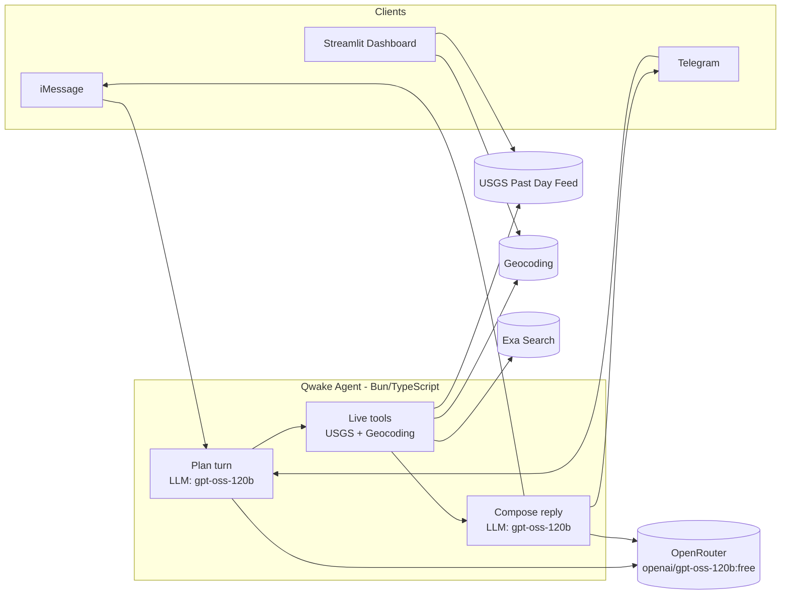

# Qwake

Map live USGS earthquakes from the past 24 hours and check whether a typed location is near recent reported activity.


## Architecture



## Streamlit dashboard

```sh
python3 -m venv .venv
. .venv/bin/activate
pip install -r requirements.txt
streamlit run earthquake-app.py
```

Deploy the dashboard on Streamlit Community Cloud with main file `earthquake-app.py`.

## Messaging agent

```sh
cd apps/agent
bun install
bun run typecheck
bun start
```

The agent uses Spectrum for iMessage and optional Telegram, plus response wording through an OpenAI-compatible gateway (OpenRouter, `openai/gpt-oss-120b:free`).

Railway agent deployment uses `apps/agent/railway.toml`. Telegram uses `TELEGRAM_BOT_TOKEN`; if that variable is missing, the agent starts with iMessage only.

See `docs/DEPLOYMENT.md` for exact Streamlit Cloud and Railway setup.
